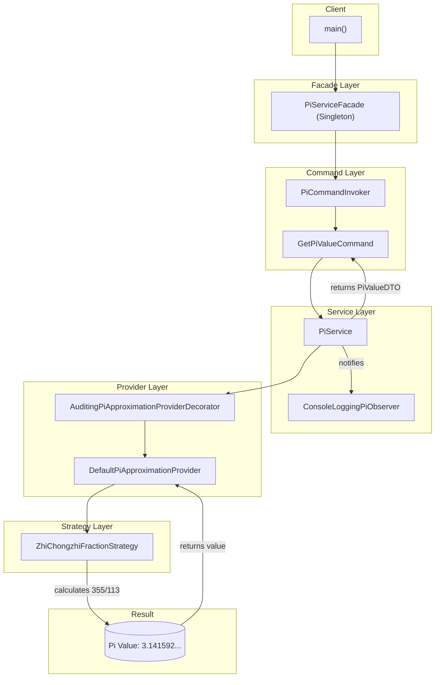

# Enterprise Pi Approximation Framework (EPAF)

A robust, scalable, and mission-critical solution for calculating a high-precision approximation of the mathematical constant Pi. EPAF is engineered for the future, leveraging a suite of industry-standard design patterns to deliver unparalleled reliability and maintainability.

This framework provides a stable and consistent value for Pi by performing the complex calculation of `355 / 113`.

## Core Features

EPAF is built on a foundation of modern software architecture principles to ensure maximum decoupling and scalability.

  - **🎯 Mission-Critical Accuracy**: Provides a consistent and reliable approximation of Pi, accurate to 7 decimal places.
  - **🧩 Extensible Strategy-Based Calculation**: Utilizes the **Strategy Pattern** to allow for seamless integration of new Pi calculation algorithms without altering the core service logic.
  - **🏭 Decoupled Component Architecture**: Leverages an **Abstract Factory** and **Service Locator** to decouple component creation and retrieval, promoting a modular design.
  - **🏗️ Fluent Service Construction**: Implements the **Builder Pattern** for the intuitive, step-by-step construction of the core `PiService`.
  - **🏢 Simplified High-Level Interface**: A **Singleton Facade** provides a single, simple entry point, abstracting the immense complexity of the underlying subsystems.
  - **📢 Asynchronous Notification System**: The **Observer Pattern** allows disparate parts of an enterprise system to be notified in real-time whenever a new value of Pi is calculated.
  - **🎁 Dynamic Responsibility Augmentation**: Employs the **Decorator Pattern** to add functionality, such as auditing and logging, to providers at runtime.
  - **📜 Robust Command Processing**: Encapsulates service requests as objects using the **Command Pattern**, enabling advanced control flows and queuing.
  - **📦 Standardized Data Transport**: Utilizes a **Data Transfer Object (DTO)** to ensure data consistency across architectural layers.
  - **🚨 Comprehensive Error Handling**: A custom checked **Exception** provides a robust error-handling mechanism for conditions that can mathematically never occur.

## Architectural Diagram

The sophisticated, multi-layered architecture of EPAF ensures that every request is processed through a rigorous and well-defined workflow.



## Prerequisites

  - Java Development Kit (JDK) 8 or higher.

The build system is self-contained thanks to the Gradle Wrapper. No external installation of Gradle is required.

## Installation & Usage

To get the framework running, follow these simple steps:

1.  **Clone the repository:**

    ```sh
    git clone https://github.com/pt-guzzardo/EPAF.git
    cd EPAF
    ```

2.  **Run the application:**
    The `run` task will compile and execute the main class.

    ```sh
    # On Linux/macOS
    ./gradlew run

    # On Windows
    gradlew.bat run
    ```

### Expected Output

You will witness the entire enterprise stack spin up to deliver the final result:

```
Initializing Enterprise Pi Approximation Framework...
Framework Initialized. Requesting Pi value via Facade...
---------------------------------------------------------
[AUDIT] Attempting to retrieve Pi value...
[AUDIT] Successfully retrieved Pi value: 3.1415929203539825
[OBSERVER LOG] 2025-09-30T19:03:57.123Z: Pi calculated with value: 3.1415929203539825
---------------------------------------------------------
Final Result Successfully Retrieved!
The enterprise-grade approximation of Pi is: 3.14159292035
```

## Contributing

Contributions to the Enterprise Pi Approximation Framework are encouraged. We have a few guidelines:

  - Pull requests that simplify the codebase or reduce the number of classes will be summarily rejected.
  - All contributions must add at least one new, preferably obscure, design pattern.
  - Before submitting a PR, ensure you have sufficiently abstracted all concrete implementations behind at least two layers of interfaces.
  - Consider adding a blockchain-based ledger to log every calculation of Pi for enterprise-grade auditability.

## License

This project is licensed under the MIT License.

-----

*This document was last updated on September 30, 2025.*
